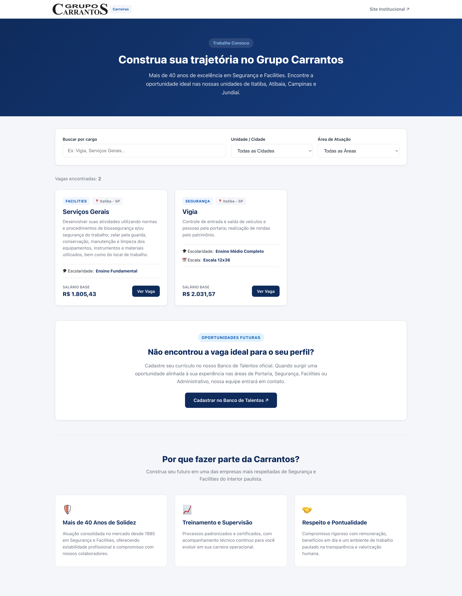
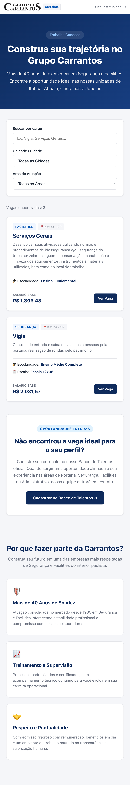

# 🏢 CARRANTOS CARREIRAS — PORTAL INSTITUCIONAL DE VAGAS

> [!NOTE]
> **Projeto de Portfólio & Solução Corporativa:** Este repositório foi desenvolvido para solucionar a centralização, filtragem regional e captação de talentos do Grupo Carrantos. O projeto valida a arquitetura front-end em **React + TypeScript + Vite**, aplicando componentização modular, design tokens nativos e padrões estritos de acessibilidade e performance em produção contínua.

Plataforma institucional de carreiras e catálogo de oportunidades operacionais desenvolvida para o **Grupo Carrantos**. A aplicação entrega uma experiência de busca e filtragem reativa em tempo real, interface corporativa moderna e total fidelidade responsiva para candidatos em dispositivos móveis e computadores.

---

## 📱 Demonstração do Projeto

  <table>
    <tr>
      <td align="center" width="60%">
        <b>💻 Versão Desktop</b>  
        
      </td>
      <td align="center" width="40%">
        <b>📱 Versão Mobile</b>  
        
      </td>
    </tr>
  </table>

---

## 🚀 Stack Tecnológica e Conceitos Aplicados

O projeto foi construído utilizando as melhores práticas do ecossistema front-end moderno, focando em robustez de tipagem, manutenibilidade e performance:

- **React Declarativo & Hooks:** Componentização desacoplada (`Header`, `Hero`, `JobFilters`, `JobCard`, `JobModal`, `TalentBank`, `CompanyCulture`) com gerenciamento de estado previsível via `useState` e sincronização de eventos de janela com `useEffect`.
- **TypeScript Estrito:** Modelagem de contratos de dados através de _Interfaces_ e _Union Types_, eliminando erros de digitação e garantindo integridade das categorias e unidades regionais antes do build.
- **Vite & Bundle Optimization:** Build tool ultrarrápida com Hot Module Replacement (HMR) e compilação otimizada para produção.
- **CSS Modules & Design Tokens:** Encapsulamento de estilos por componente para prevenir poluição de escopo global, orientado por tokens corporativos centralizados no `:root`.
- **HTML5 Semântico & Acessibilidade (A11y):** Uso de tags estruturais (`header`, `main`, `section`, `article`), atributos ARIA (`aria-modal`, `role="dialog"`, `aria-labelledby`) e navegação assistida por teclado via tecla `Escape`.
- **Formatação Monetária com API Nativa:** Tratamento de valores salariais utilizando `Intl.NumberFormat` para o padrão monetário brasileiro (BRL).

---

## 📝 Funcionalidades em Destaque

- **Filtros Dinâmicos Combinados:** Busca textual instantânea integrada a seletores de Unidade/Cidade (Itatiba, Atibaia, Campinas, Jundiaí) e Área de Atuação (Facilities, Segurança, Portaria, Administrativo) com tratamento de estado vazio (_empty state_)[cite: 1].
- **Layout Responsivo Automático:** Grid autoajustável com CSS `repeat(auto-fill, minmax(320px, 1fr))` para adaptação fluida em qualquer resolução sem sobrecarga de media queries.
- **Modal de Detalhamento Acessível:** Exibição completa de atividades, escolaridade, escalas e benefícios com bloqueio de propagação de eventos (_event bubbling_).
- **Candidatura Multicanal:** Integração direta com mensagens pré-formatadas para a API do WhatsApp e redirecionamento para o formulário oficial de captação.
- **Seção Banco de Talentos & Cultura:** Captação de candidatos fora do perfil imediato e apresentação dos pilares institucionais e diferenciais da empresa[cite: 1].

---

## 🌐 Deploy em Produção

O projeto encontra-se publicado e disponível para testes em:  
🔗 **[carrantos-vagas.vercel.app](https://carrantos-vagas.vercel.app)**

---

## 👨‍💻 Autor

Desenvolvido por **Lincoln Berto**.

- **LinkedIn:** [https://www.linkedin.com/in/lincoln-berto/](https://www.linkedin.com/in/lincoln-berto/)
- **GitHub:** [https://github.com/eilincoln](https://github.com/eilincoln)
- **Portfólio:** [https://lincolnberto.com.br](https://lincolnberto.com.br)
